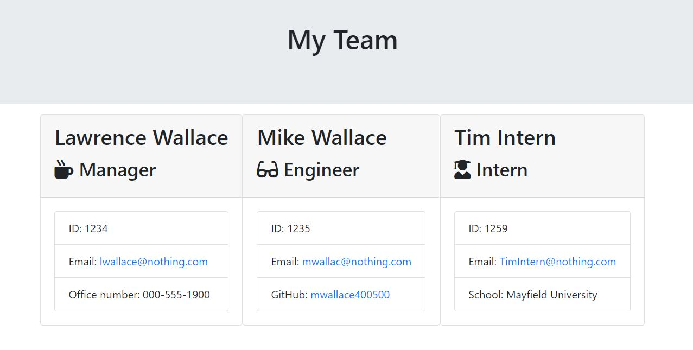

# Me Read Read Me

## Description
A simple readme generator for projects on github. The app takes user responses to prompts to create a new readme, with appropriate markdown syntax and images.

## Table of Contents:
-Installation
-Usage
-Credits
-License

## Installation Instructions
After cloning this repo, download the necessary inquirer npm package using 'npm i inquirer' in the terminal.

## Usage
The user should run this application in VSCode or another code editor. After exectuting the command 'node index.js', the user will be presented with a series of questions relating to the content of their readme. It is very important that the user answers the prompts as specifically and thoroughly as possible, as the application uses their input to complete the necessary sections. After all the prompts have been answered, the application will generate a new readme file with the input and template literals to make a very readable guide to their application. N.B.- the location of the new file is defined relative to where this application is being run. In general, it should be in the same folder as the 'index.js' source file for this application, wherever that may be on the user's local machine.

### Running tests
To test, run 'npm test' in the terminal.

## Credits
Created by Lawrence Wallace 
Github profile: lwallac21
Email: lwallac21@gmail.com

### Contributors
No one else contributed
Please do not contribute or edit this repo. It is a solo project.

## License

